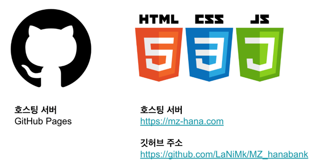

# MZ_hanabank
    
 
디지털 하나로 첫번째 과제 - HTML, CSS, JS로 웹 페이지 만들기
 
**[mz-hana.com](mz-hana.com)**

## 1. 프로젝트 배경

#### 1-1. 프로젝트 주제 선정 및 배경

하나은행의 주거래자는 50대 전후 장년층으로 현재 그들을 기반으로 준수한 실적을 내고 있습니다. 그에 비해 하나은행에 대한 2030의 선호도는 낮은 편으로 카카오뱅크, 토스뱅크 등 다른 은행에 비해 인지도 및 선호도가 낮은 편에 속합니다. 현재는 은행의 주 수입원이 이자이익이지만 앞으로의 미래 성장을 위해 지금부터 2030의 선호도를 높이는 것이 중요하다고 판단하였습니다. 

따라서 사용자 다양성을 확대하고 MZ세대를 겨냥한 웹 사이트의 필요성을 인지하여 기존의 하나은행 사이트의 내용을 MZ세대들이 많이 사용하는 토스뱅크, 카카오 뱅크 등의 디자인 및 기능을 참고하여 구축하는 것을 주제로 선정하게 되었습니다. 구체적으로 토스뱅크의 기술력은 현재 이러한 세대들에게 크게 어필이 되고 있다는 점을 주목하여 이 부분을 벤치마킹 하는 것 또한 고려하기로 하였습니다. 

#### 1-2. 프로젝트 목적
프로젝트 명, 가칭 MZ 하나은행은 기존의 하나은행 사이트를 새로운 구성과 기능을 통해 1020을 겨냥한 페이지입니다. 저희가 새로 구축한 페이지를 통해 낮은 연령층의 사용자가 디자인과 여러 기능을 통해 흥미를 느끼게 할 예정입니다. 또한 디자인 뿐만 아니라, 직관적인 구성을 통해 이용성과 편리성을 극대화하는 방향으로 개발하고자 합니다.

특히 토스뱅크가 홈페이지 디자인을 통해 브랜드 이미지를 제고하는 것에 주목하였습니다. 토스뱅크의 경우 화려하고 깔끔한 홈페이지를 통해 스스로의 브랜드를 나타내고 있으며, 이는 많은 사람들에게 꾸준하게 주목을 받으며 하나의 유행을 선도하고 있다고 생각합니다. 따라서 저희는 이러한 토스뱅크의 전략을 참고하여 하나은행 홈페이지의 기본적인 틀과 내용을 바탕으로 화려한 스크롤 애니메이션이 가미된 반응형 홈페이지를 구축하기로 결정하였습니다. 

이 프로젝트의 가장 큰 기대효과는 새로 구축한 홈페이지를 통해 하나은행에 대한 2030의 선호도를 높여, 그들이 중장년층이 되었을 때, 미래의 가망고객을 확보하는 것입니다. 

#### 1-3. 프로젝트 개요
Html, css, javascript를 이용해 구현

## 2. 팀 구성 및 역할

이름 | 맡은 역할
------------|------|
[LaNiMk(팀장)](https://github.com/LaNiMk) | 1. FAQ(자주 묻는 질문) 페이지 구축 2. 이벤트 페이지(진행 중인 이벤트, 종료된 이벤트) 구축  3. 보고서 작성 |
[alivejuicy](https://github.com/alivejuicy) | 1. 로그인 페이지 구축 2. 회원가입 페이지 구축 3. 발표 |
[helloalpaca](https://github.com/helloalpaca) | 1. 회사 소개 페이지 구축 2. 오시는 길 페이지 구축 3. 응원카드 만들기 페이지 구축 |
[lake041](https://github.com/lake041) | 1. 홈 메인 페이지 구축 2. 상품소개 페이지 구축 3. 헤더/푸터 4. 발표 |

## 3. 프로젝트 수행 절차 및 방법
#### 3-1. 일정 계획

<table>
    <thead>
    <tr>
        <th>개발 기간</th>
        <th colspan="2">2023.5.04. ~ 2022.6.05.(33일)</th>
    </tr>
    </thead>
    <tbody>
    <tr>
        <td>프로젝트명</td>
        <td colspan="2">MZ_하나은행</td>
    </tr>
    <tr>
        <td rowspan="5">프로젝트  개발기간</td>
        <td>작업내용</td>
        <td>개발 기간</td>
    </tr>
    <tr>
        <td>공통 CSS 컴포넌트 작성</td>
        <td>2023-05-11 ~ 2023-05-15</td>
    </tr>
    <tr>
        <td>홈 화면/푸터/헤더 구축</td>
        <td>2023-05-16 ~ 2023-05-18</td>
    </tr>
    <tr>
        <td>개인 페이지 구축</td>
        <td>2023-05-19 ~ 2023-05-24</td>
    </tr>
    <tr>
        <td>CSS 애니메이션, JS 이벤트 추가</td>
        <td>2023-05-26 ~ 2023-06-02</td>
    </tr>
    <tr>
        <td>최종 점검 및 발표</td>
        <td>2022-06-03 ~ 2022-06-05 </td>
    </tr>
    <tr>
        <td>작업 순서</td>
        <td colspan="2">주제선정→ 계획 → 설계 → 구현 → 시험 및 유지 보수</td>
    </tr>
    <tr>
        <td>필요 자원</td>
        <td colspan="2">Vscode(html, css, javascript), Github</td>
    </tr>
    </tbody>
</table>

 

#### 3-2. 배포 환경
[MZ 하나은행 바로가기](mz-hana.com)
 
 
 

## 4. 프로젝트 결과

#### 4-1. 시연 동영상
PC버전
 
 
 
 
모바일 버전
 
 
